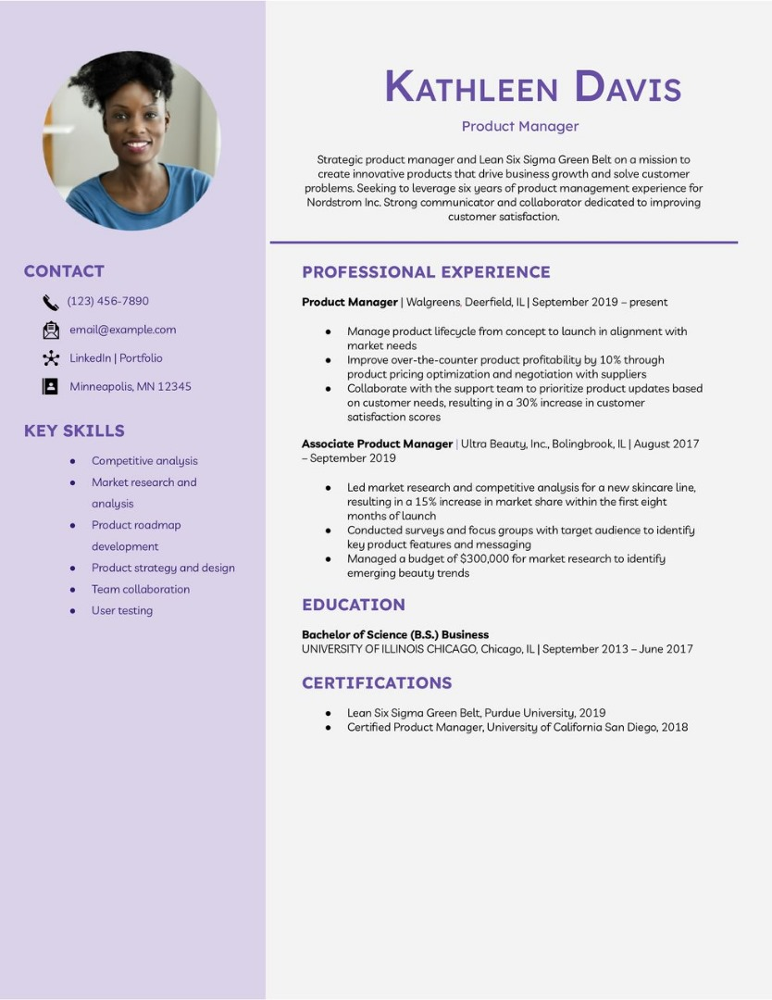

# Projet CV Responsive

## Description
Ce projet est un modèle de CV professionnel responsive, conçu pour s'adapter à toutes les tailles d'écran. Le design s'inspire d'un format moderne de CV avec une colonne latérale pour les informations de contact et compétences, et une section principale pour l'expérience professionnelle et l'éducation.



## Fonctionnalités

- **Design responsive** : S'adapte aux écrans de bureau, tablettes et mobiles
- **Mise en page moderne** : Structure à deux colonnes sur desktop, basculant en une colonne sur mobile
- **Palette de couleurs personnalisable** : Utilisation de variables CSS pour modifier facilement les couleurs
- **Typographie optimisée** : Utilisation de la police Montserrat avec tailles adaptatives
- **Structure propre** : Organisation claire du contenu pour une meilleure lisibilité

## Technologies utilisées

- HTML5
- CSS3 (Flexbox, Media Queries, Variables CSS)
- Google Fonts (Montserrat)

## Structure du projet

```
/
├── index.html              # Fichier HTML principal
├── css/
│   └── styles.css          # Styles CSS (optionnel - intégré dans HTML pour ce projet)
├── js/
│   └── script.js           # JavaScript (pour d'éventuelles extensions futures)
└── asset/
    └── img/
        ├── moi.jpg         # Photo de profil
        └── preview.jpg     # Aperçu du CV pour le README
```

## Installation et utilisation

1. Clonez ou téléchargez ce dépôt
2. Ouvrez le fichier `index.html` dans votre navigateur web
3. Pour personnaliser le CV avec vos informations :
   - Modifiez le contenu dans le fichier HTML
   - Remplacez l'image de profil dans `asset/img/moi.jpg`
   - Ajustez les couleurs en modifiant les variables CSS dans la balise `<style>`

## Personnalisation

### Modifier les couleurs

Vous pouvez facilement changer les couleurs principales en modifiant les variables CSS :

```css
:root {
    --primary-color: rgb(116, 85, 151);    /* Couleur principale (violet) */
    --left-bg-color: rgb(225, 216, 235);   /* Couleur de fond gauche (violet clair) */
    --right-bg-color: rgb(241, 241, 241);  /* Couleur de fond droite (gris clair) */
}
```

### Ajouter des icônes

Les icônes dans la section Contact utilisent des emoji Unicode. Vous pouvez les remplacer par des icônes Font Awesome ou d'autres bibliothèques d'icônes en modifiant la classe `.icon` et en ajoutant les références nécessaires.

### Modifier la structure

La mise en page utilise Flexbox pour son organisation. Les proportions des colonnes peuvent être modifiées en ajustant les valeurs de `width` dans les classes `.left_part` et `.rigth_part`.

## Responsive Design

Le CV s'adapte automatiquement aux différentes tailles d'écran :

- **Desktop** (> 768px) : Affichage à deux colonnes (30% / 70%)
- **Tablette** (< 768px) : Disposition à une colonne 
- **Mobile** (< 480px) : Tailles réduites pour les petits écrans

## Bonnes pratiques implémentées

- Utilisation de HTML sémantique
- Variables CSS pour la maintenabilité
- Unités relatives (rem, %, vw) pour une meilleure adaptabilité
- Fonction `clamp()` pour des tailles de texte fluides
- Media queries pour les ajustements responsive
- Box-sizing uniforme pour une gestion cohérente des dimensions

## Améliorations possibles

- Ajouter des animations subtiles
- Implémenter un mode sombre
- Créer plusieurs thèmes de couleurs
- Ajouter des options d'impression optimisées
- Développer une version interactive avec des sections expansibles

## Licence

Ce projet est disponible sous licence MIT. Vous êtes libre de l'utiliser, le modifier et le distribuer pour vos propres besoins.

---

*Ce README a été créé pour documenter le projet de CV responsive développé en HTML et CSS.*